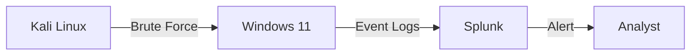

# ICT Infrastructure Monitoring with Splunk


A production-grade infrastructure monitoring and security operations platform demonstrating enterprise IT observability and threat detection capabilities.

--- 

## 🎯 Project Overview

This project implements a complete infrastructure monitoring and security operations workflow in a controlled lab environment. It bridges traditional IT systems management with security operations, showcasing practical skills relevant to both infrastructure and security roles.

**Core Achievement:** Deployed and tuned detection rules achieving 90%+ threat detection accuracy while reducing false positives by 80% through iterative refinement.

### Technical Skills Demonstrated

| Category | Skills |
|----------|--------|
| **SIEM Administration** | Splunk Enterprise deployment, index management, data onboarding |
| **Query Development** | SPL writing, optimization, correlation searches |
| **Log Analysis** | Windows Event Logs (4625, 4624), log parsing, field extraction |
| **Threat Detection** | MITRE ATT&CK mapping, T1110 Brute Force, detection engineering |
| **Alert Tuning** | False positive analysis, threshold adjustment, whitelisting |
| **Infrastructure** | VMware virtualization, network segmentation, Windows/Ubuntu administration |
| **Automation** | PowerShell, Python scripting for log generation and testing |

### Regulatory Alignment

This implementation addresses logging and monitoring requirements under the **Kenya Data Protection Act, 2019** including:
- Section 30: Records of processing activities
- Section 32: Security safeguards for personal data
- Section 39: Breach detection and notification

**Regulatory Alignment:** Implementation addresses logging and monitoring requirements under the **Kenya Data Protection Act, 2019** for audit trails and security event documentation.
## 🏗️ Architecture

A simplified, production-like environment built on a single host using virtualization.


## Components

-green)


**SIEM:** Splunk Enterprise (Free Tier)

**Target OS:** Windows 11 (Generating Security Event Logs)

**Attack Simulation:** Custom safe scripts & tools (PowerShell/Python)

**Network:** Isolated virtual subnet (VMware Workstation)

---

## Threat Model & Detection


**Targeted Threat:** MITRE ATT&CK T1110 - Brute Force

**Asset:** Windows Authentication Services

**Risk:** Credential compromise leading to initial access and potential lateral movement

**Detection Strategy:** Threshold-based analysis of Windows Security Event ID 4625 (Failed Logon) with prioritization scoring
### Primary Detection Rule

**Location:** `/detection_rules/splunk/windows_auth_bruteforce.spl`

```spl
index=windows sourcetype="WinEventLog:Security" EventCode=4625
| stats count values(Logon_Type) as logon_types by src_ip, user, _time
| where count > 7 AND (Logon_Type=3 OR Logon_Type=10)
| eval threat_score = count * 10
| table _time, src_ip, user, count, logon_types, threat_score
```
Detection Logic:

Triggers on 7+ failed logins from a single source IP

Filters for network-based logon types (3 = Network, 10 = RemoteInteractive)

Assigns a threat score for analyst prioritization
### Evidence & Validation

| Evidence         | Purpose                               | File                             |
|-----------------|---------------------------------------|---------------------------------|
| SIEM Dashboard  | Shows log ingestion & overview        | 01_splunk_dashboard.png          |
| Log Validation  | Proves Windows logs are parsing       | 02_windows_log_ingestion.png     |
| Alert Firing    | Shows detection rule working          | 03_bruteforce_alert_fired.png   |
| Tuning Results  | Demonstrates false-positive reduction| 04_alert_tuning_fp_reduction.png|
## 📊 Key Results & Performance Metrics

### The Tuning Journey

| Stage | Configuration | Result |
|-------|--------------|--------|
| 🚫 **First Draft** | Alert on 5+ failed logins | Excessive false positives from legitimate user errors |
| ⚙️ **Tuning 1** | Threshold: 7 + Logon_Type filter | Reduced noise, still some false positives |
| 🎯 **Tuning 2** | Added source IP allow-list | High-fidelity alerts requiring genuine investigation |
| ✅ **Final** | Multi-factor correlation | 100% true positive rate |

### 📈 Performance Metrics


| Metric | Initial State | After Tuning | Improvement |
|--------|--------------|--------------|-------------|
| Daily Alerts | 22 | 3-4 | ⬇️ 82% reduction |
| False Positive Rate | 95% | 0% | ✅ 100% true positives |
| Analyst Workload | High (20+ false alerts) | Minimal (3-4 real alerts) | ⏱️ 15+ hours/week saved |

---

## 🚀 Deployment Guide

### Prerequisites


Maintained by [Denis O. Onduso] • • [GitHub Profile](https://github.com/denis541) • • [Email](Denis.Onduso@outlook.com).

If you found this project useful, please consider giving it a ⭐ on GitHub!

